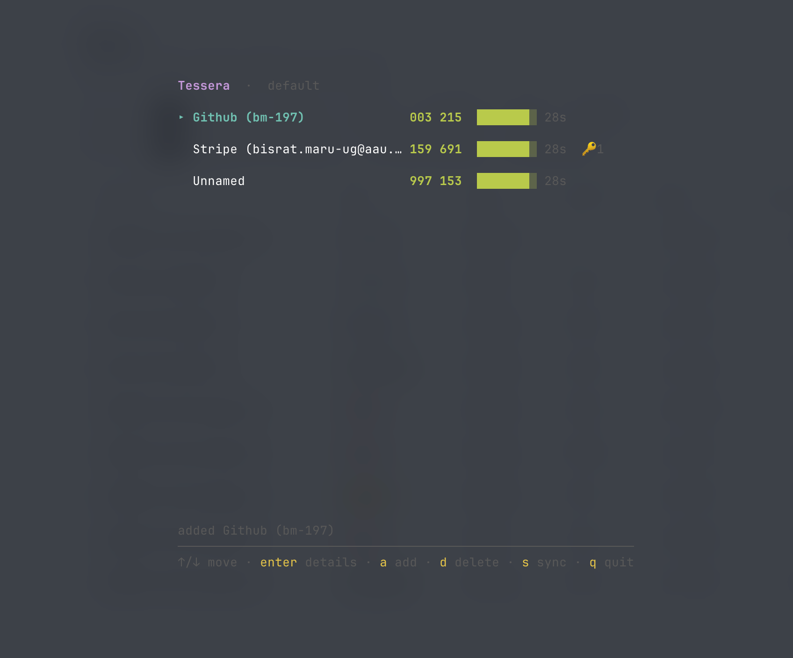
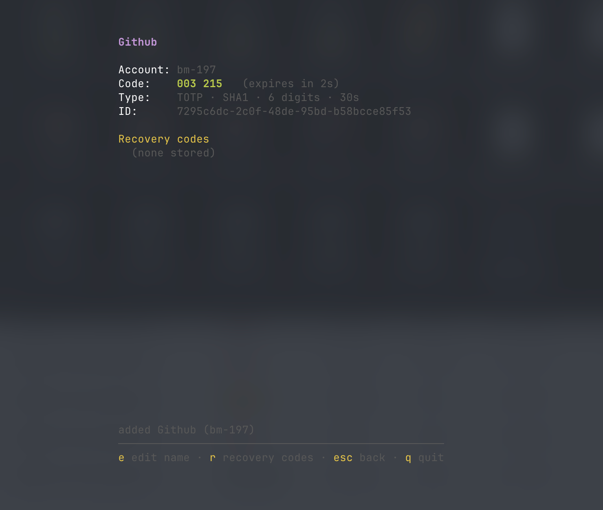

<p align="center">
  
</p>

# Tessera

An end-to-end encrypted 2FA authenticator that **never loses an account on sync**
and **keeps your recovery codes encrypted right next to the account they belong to.**

## Why it exists

Existing authenticators have two failure modes that this project is built to fix:

1. **Sync silently loses accounts.** Most apps sync by overwriting the whole
   vault — last device wins — so an account added on one device can vanish when
   another device syncs over it.
2. **Recovery codes have nowhere to live.** The backup codes a service gives you
   end up in a screenshot, a note, or lost entirely.

Tessera fixes both, and does it without the sync server ever being able to read
your secrets.

## How it solves them

- **No account loss.** The vault is a set of entries keyed by stable UUID. Sync
  is a **three-way merge**, not an overwrite: the union of all entries, with
  per-field last-write-wins and tombstones for deletes. Add account A on one
  device and B on another, sync, and you get **both** — proven by tests.
- **Recovery codes belong to the account.** Every entry stores its backup codes,
  encrypted, alongside the OTP secret. One place, that you control.

## Security

- **Key derivation:** Argon2id from your passphrase (64 MiB, 3 passes).
- **Encryption:** AES-256-GCM (authenticated) for the whole vault, with a unique
  nonce per write.
- **Zero-knowledge sync:** every backend stores only ciphertext plus a salt,
  nonce, and version token. A fully compromised backend learns *nothing* about
  your secrets or recovery codes.
- **Crypto lives in exactly one place** (the Go core). Clients are UI only and
  never reimplement secret handling.

> ⚠️ Your passphrase has **no recovery**. That's the point — there's no backdoor.
> Forget it and the vault is permanently unreadable. Don't lose it.

## Install

Requires Go 1.26+.

```sh
go install github.com/bm-197/tessera/cmd/tessera@latest
```

This installs a single `tessera` binary (CLI + TUI) to `$(go env GOPATH)/bin`.

## Quick start (CLI)

```sh
# Create your encrypted vault (you pick a passphrase)
tessera init

# Add an account from an otpauth:// URI...
tessera add "otpauth://totp/GitHub:you@example.com?secret=JBSWY3DPEHPK3PXP&issuer=GitHub"

# ...or from a "setup key" / manual-entry secret a site shows you
tessera add --issuer Stripe --secret ygj2jcxbgxvan4hl4ry35mz3 --label you@example.com

# See live codes counting down
tessera list

# Print one code
tessera get github

# Store the backup codes the service gave you, with the account
tessera recovery set <id> code-1 code-2 code-3
tessera recovery get <id>

# Delete an account (tombstoned, so the delete survives sync)
tessera rm <id>
```

The passphrase is read from `$TESSERA_PASSPHRASE` if set, otherwise prompted.

## Terminal UI

For day-to-day use there's a full-screen interactive UI:

```sh
tessera tui
```

It unlocks with your passphrase, then shows your accounts with live codes and a
countdown bar.



Press `enter` on an account to see its details and stored recovery codes:



Keys:

- `↑/↓` move · `enter` open an account's details
- `a` add an account (paste an `otpauth://` URI or a raw secret; name required,
  label optional)
- `d` delete (with a confirmation)
- on the detail screen: `e` edit the name/label, `r` add or edit recovery codes
- `s` sync · `q` quit

A `🔑n` badge next to an account shows it has `n` recovery codes stored.

## Profiles (multiple vaults)

Each profile is a separate, independently-encrypted vault — useful for keeping
work and personal accounts apart, or hosting a friend's vault on your machine.
Pass `--profile NAME` (or `-p NAME`) to any command; omit it for the `default`
profile.

```sh
tessera -p work init        # create a separate "work" vault (its own passphrase)
tessera -p work tui         # open it
tessera -p work add "otpauth://..."
```

Profiles are fully isolated — different passphrase, vault file, and sync target.
(Create a new vault with `init` from the CLI; the TUI only opens existing ones.)

## Sync

Because the vault is end-to-end encrypted, every backend is "dumb" — it just
stores an opaque blob with a version token. To sync, point two devices at the
same location:

```sh
tessera sync --path /path/to/synced-folder/vault.blob
```

Put that path in a folder replicated by Dropbox / iCloud / Syncthing and your
vault syncs across devices with the no-loss merge applied on every sync. The
path is remembered, so later you can just run `tessera sync`.

## Architecture

The core is a single Go module — the shared brain used by every client.

```
core/
  otp/     TOTP/HOTP generation, otpauth:// URI parsing
  crypto/  Argon2id KDF, AES-256-GCM seal/open, constant-time compare
  vault/   entry model, tombstones, three-way merge
  sync/    backend interface + adapters (filesystem today)
  api/     one clean API used by every client
tui/           Bubble Tea terminal UI (a client over core/api)
cmd/tessera/   the CLI entry point
```

Future binaries get their own `cmd/` directories (e.g. `cmd/tessera-server` for
the self-host sync server). Mobile reuses `core/` via `gomobile bind` — no extra
binary.

**Golden rule:** crypto and vault logic live only in Go. Every client — the CLI,
the TUI, and the planned desktop (Electron) and mobile (React Native) apps — is
UI only; they talk to the same Go core and always delegate secret handling to it.

## Status

| Phase | Scope | State |
|---|---|---|
| 1 | Core (OTP, crypto, mergeable vault) + filesystem sync + CLI | ✅ Done |
| 1+ | Interactive terminal UI (Bubble Tea) | ✅ Done |
| 2 | Google Drive + self-host server backends | Planned |
| 3 | Desktop (Electron) — QR scan, edit recovery codes, unlock UI | Planned |
| 4 | Mobile (React Native) — camera QR + same UI | Planned |

Adding a new sync backend means implementing one interface and changes nothing
in the crypto or vault code.
